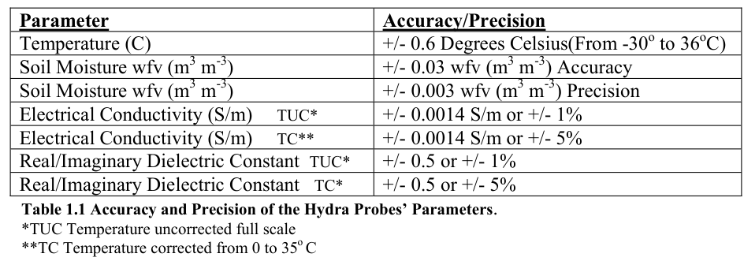
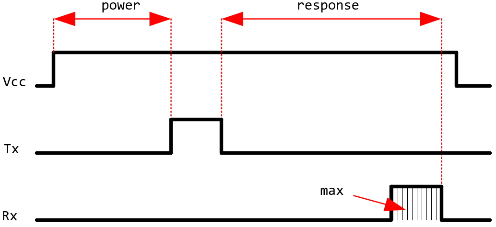

Tipos de sensores soportados
############################

.. sectnum:: 
   :suffix: .-
   :start: 4
   :depth: 2

.. contents::
   :depth: 2 

.. _sensors:

Soil Temperature Humidity And EC Sensor (Gemho)
***********************************************

El sensor de humedad / conductividad / temperatura del 
suelo, de ahora en más referido como **sensor THE**, es una 
herramienta importante para estudiar suelos salinos y su 
dinámica de salinidad. Mide la constante dieléctrica del 
suelo para reflejar con precisión el contenido de humedad 
del suelo. Es aplicable en diversas ocasiones como 
monitoreo de humedad del suelo, experimentos científicos, 
riego eficiente, invernaderos, agricultura de precisión, 
entre otros. Tiene características como integración de 
tres parámetros, resistencia a impactos y corrosión, alta 
precisión y opciones de salida de señal.

Características
===============

- Fabricante: Weihai Gemho Digital Mining Co., Ltd.
- Origen: chino.
- Alimentación: 3.6 / 30V.
- Medición de temperatura:
    - Rango: -40 a ~80℃. 
    - Resolución: 0.1℃.
    - Precisión: ±0.5℃.
- Medición de humedad:
    - Rango: 0-50% o 0-100% (configurable).
    - Resolución: 
        - 0.03% en el rango 0-50%.
        - 1% en el rango 50-100%.
    - Precisión: 
        - ±2% en el rango 0-50%.
        - 3% en el rango 50-100%.
- Medición de electroconductividad:
    - Rango: 0-5000us/cm, 10000us/cm, 20000us/cm (configurable).
    - Resolución: 
        - 10us/cm en el rango 0-10000us/cm.
        - 50us/cm en el rango 100000-20000us/cm.
    - Precisión: 
        - ±3% en el rango 0-10000us/cm.
        - ±5% en el rango 10000-20000us/cm.
- Entorno operativo: -40 a ~85℃.

Valores normales de un suelo agrícola
=====================================

.. csv-table:: Valores normales de temperatura, humedad y EC.
   :header: Parámetro, Unidad, Mínimo, Máximo, Aire
   :widths: 10, 10, 10, 10, 10

   Temperatura , °C , 15 , 30 , Ambiente
   Humedad , %RH , 50 , 70 , ~50*
   Electroconductividad , uS/cm , 0 , 500 , 0

.. note:: 

   Si bien el sensor de humedad podría medir la humedad 
   relativa del aire, que puede ser diferente a la humedad del 
   suelo, puede variar ampliamente dependiendo del clima y la 
   ubicación, pero en promedio, suele estar entre el 30% y el 
   70%. Sin embargo, en el laboratorio registramos un valor nulo.

Conexión 
========

.. csv-table:: Conexión sensor THE
   :header: Color, Descripción
   :widths: 10, 10
   :align: center

   Rojo, 12V
   Negro, Ground
   Verde, RS485(A)
   Amarillo, RS485(B)

Tramas
======

El sensor THE recibe una sola trama y envía otra trama. Para que 
mida temperatura, humedad y electroconductividad (the), la trama 
que se le envía es se llama ``THE_request``, y es la siguiente:

.. csv-table:: Trama THE_request (8 bytes)
   :header: Add, Function code, Register start address, Register length, CRC
   :widths: 10, 10, 10, 10, 10
   :align: center

   0x01, 0x03, 0x00 0x06, 0x00 0x03, 0xE5 0xCA

- **Add**: dirección del dispositivo esclavo. Indica qué dispositivo 
  esclavo MODBUS debe responder a la solicitud. En este caso, se está 
  comunicando con el dispositivo esclavo de dirección 1, que es la que 
  viene por defecto en el sensor.
- **Function code**: indica el tipo de operación que se realizará en el 
  dispositivo esclavo. En este caso, se está solicitando una lectura de 
  registros de entrada con el código 03.
- **Register start address**: indica la dirección del primer registro 
  que se leerá. En este caso, el registro de inicio es 0x0006.
- **Register length**: cantidad de registros a leer. Indica cuántos 
  registros se leerán en la solicitud. En este caso, se están solicitando 
  3 registros.
- **Register length**: CRC (Cyclic Redundancy Check). Es un valor de 
  verificación que se utiliza para asegurar la integridad de los datos 
  transmitidos. Estos dos bytes contienen el resultado del cálculo del 
  CRC.

La trama de respuesta se llama ``THE_response``, y es como sigue:

.. csv-table:: Trama THE_response (11 bytes)
   :header: Address, Function code, Effective number of bytes, Temp., Hum., EC, CRC
   :widths: 10, 10, 10, 10, 10, 10, 10

   0x01, 0x03, 0x06, 0x01 0x2C, 0x02 0x92, 0x1D 0x4C, 0xEC 0xA6

- **Add**: dirección del dispositivo esclavo.
- **Function code**: indica el tipo de operación que se realizará en el 
  dispositivo esclavo. En este caso, se está solicitando una lectura de 
  registros de entrada con el código 03.
- **Effective number of bytes**: es la cantidad de bytes que conforma la 
  información de las variables medidas.
- **Temp**: valor de temperatura. En este caso se recibe 0x01, 0x2C; 
  se los coloca juntos para formar el hexa ``0x012C``, y convertido a 
  decimal queda: 300, se lo divide entre 100 y se obtiene el valor 
  de temperatura ``Temp=3.00°C``.
- **Hum**: valor de humedad; ídem al anterior y se obtiene ``Hum=6.58%RH``.
- **EC**: valor de electroconductividad; ídem al anterior pero no se lo 
  divide entre 100 y se obtiene ``EC=7500us/cm``.
- **CRC**: CRC (Cyclic Redundancy Check).

RS485/4-20mA Soil NPK Sensor (Gemho)
************************************

El sensor de suelo Ghhb-031-485 NPK, de ahora en más 
referido como **sensor NPK**, es un nuevo sensor integrado. 
Obtiene el contenido de nitrógeno, fósforo y potasio en el 
suelo donde está ubicado el equipo a través del equipo de 
adquisición.

El sensor NPK utiliza el principio de reflexión de dominio 
de frecuencia (FDR). Basado en el pulso electromagnético 
y la frecuencia de propagación de ondas electromagnéticas 
en el medio, se mide la constante dieléctrica aparente del 
suelo para obtener el contenido de nitrógeno, fósforo y 
potasio en el suelo.

El sensor tiene un bajo consumo de energía, alta precisión, 
alta sensibilidad, amplio rango lineal, fuerte capacidad 
antiinterferencias, excelente repetibilidad y estabilidad.

El producto se puede utilizar ampliamente en monitoreo 
ambiental, monitoreo meteorológico, agricultura 
inteligente, viveros de huertos, flores e investigación 
del suelo. En comparación con los sensores tradicionales 
de Internet de las cosas, tiene ventajas de alta 
precisión y fácil instalación.

El sensor NPK funciona como el sensor THE, se le envía dos tipos de 
tramas dependiendo qué parámetros se quiere. Para la temperatura, 
humedad y electroconductividad, se le envía la trama THE_request; y 
para el nitrógeno, fósforo y potasio, la trama NPK_request.

Características 
===============

- Fabricante: Weihai Gemho Digital Mining Co., Ltd.
- Origen: chino.
- Alimentación: 9-18 V :sub:`CC`.
- Rango: 0-1999mg/kg (para los parámetros N, P y K).
- Resolución: ±2 % de F.E.
- Precisión: ±2 % de F.E.
- Entorno operativo: 5℃ a ~45℃.
- Humedad: 15 a ~90%RH.

.. warning:: 

   Las especificaciones de este sensor son distintas a las
   del sensor THE (temperatura, humedad y EC). Para una mejor
   comprensión, referirse a los manuales.

Conexión 
========

.. csv-table:: Conexión sensor NPK
   :header: Color, Descripción
   :widths: 10, 10
   :align: center

   Rojo, 12V
   Negro, Ground
   Verde, RS485(A)
   Amarillo, RS485(B)

Valores normales de un suelo agrícola
=====================================

.. csv-table:: Valores normales
   :header: Parámetro, Unidad, Rango promedio, Aire
   :widths: 10, 10, 10, 10

   Nitrógeno, mg/kg, 20-100, 0
   Fósforo, mg/kg, 10-50, 0
   Potasio, mg/kg, 80-200, 0

.. note:: 
   Los valores mínimo y máximo están sacados de internet groso 
   modo y podrían variar dependiendo de un suelo agrícola en 
   específico.

Tramas
======

La trama de pedido de NPK es la misma que para los sensores THE y 
la trama de respuesta también. La trama ``NPK_request`` es:

.. csv-table:: Trama NPK_request (8 bytes)
   :header: Add, Function code, Register start address, Register length, CRC
   :widths: 10, 10, 10, 10, 10

   0x01, 0x03, 0x00 0x1E, 0x00 0x03, 0x65 0xCD

Y la trama de respuesta ``NPK_response`` es:

.. csv-table:: Trama NPK_response (11 bytes)
   :header: Address, Function code, Effective number of bytes, N, P, K, CRC
   :widths: 10, 5, 10, 10, 10, 10, 10

   0x01, 0x03, 0x06, 0x00 0x25, 0x00 0x25, 0x00 0x28, 0x41 0x28

- **N**: valor de nitrógeno. En este caso se recibe 0x00, 0x25; se los coloca 
  juntos para formar el hexa ``0x025C``, y convertido a decimal queda: 37 y 
  se obtiene el valor de nitrógeno ``N=37 mg/kg``.
- **P**: valor de fósforo; ídem al anterior y se obtiene ``P=49 mg/kg``.
- **K**: valor de potasio; ídem al anterior y se obtiene ``K=40 mg/kg``.

SUP-ZP Ultrasonic level transmitter (Supmea)
********************************************

El medidor de nivel ultrasónico, de ahora en más referido como 
**sensor LEVEL**, es un dispositivo universal que 
combina las ventajas de varios otros medidores de nivel para lograr 
un diseño completamente digital y humanizado. Ofrece una medición y 
control de nivel perfectos, funciones de transmisión de datos y 
comunicación entre el hombre y la máquina.

Este producto utiliza un diseño de circuito modular, una placa PCB de 
varias capas de calidad militar, una estructura de hardware compacta y 
una disposición razonable. Admite una salida aislada de 4~20 mA, cuenta 
con módulos de transmisión de datos inalámbricos incorporados, como 
GPRS, LORA, GPS, RF y Bluetooth. También puede agregar módulos para 
lograr otras funciones según las necesidades del cliente.

El medidor utiliza chips de grado industrial importados y circuitos 
integrados especiales de compensación de temperatura digital, lo que le 
otorga una fuerte capacidad antiinterferencias. Además, permite 
ajustar arbitrariamente los límites superior e inferior de la salida 
en línea y cuenta con una pantalla local. La carcasa está hecha de 
plástico ABS resistente al agua, lo que lo hace compacto y robusto.

Este producto puede satisfacer la mayoría de los requisitos de medición de nivel de líquido y nivel de material sin entrar en contacto con el medio industrial. Además, resuelve completamente las limitaciones de los métodos de medición tradicionales, como los medidores de nivel de tipo de presión, capacitivos y flotantes, que pueden sufrir problemas de enrollado, obstrucción, fugas, corrosión del medio y mantenimiento inconveniente. Por lo tanto, puede utilizarse ampliamente en diversos campos relacionados con la medición y control de nivel de material y líquido.
El sensor de nivel registra la distancia que hay entre la punta del 
sensor y la superficie de un líquido.

Características
===============

- Fabricante: Supmea.
- Origen: chino.
- Voltaje de operación 6-32 V :sub:`CC`.
- Rango de medición: 5m, 10m,15m.
- Blind zone (zona ciega): 
    - 0.4m (para un rango de 5m).
    - 0.5m (para un rango de 10m).
    - 0.6m (para un rango de 15m).
- Precisión: 0.3%F.S.
- Consumo: <1.5W.
- Temperatura de operación: -20 a ~60℃.
- Medición opcional de distancia incremental/diferencial para medir 
  el espacio de aire o el nivel de líquido
- Intensidad de pulso transmitido de 1 a 15 dependiendo de las 
  condiciones de trabajo.

Conexión
========

.. csv-table:: Conexión de un sensor de nivel
   :header: Conector, Nombre
   :widths: 10, 10

   3, RS485(A)
   4, RS485(B)
   5, 12V
   6, GND

Tramas
======

La trama de pedido de medición ``level_request`` de un sensor de 
nivel es:

.. csv-table:: Trama level_request (8 bytes)
   :header: Address, Function code, Register address, Read data lenght, CRC
   :widths: 10, 10, 10, 10, 10
   
   01, 04, 0x00 0x00, 0x00 0x02, 0x71 0xCB

- **Address**: dirección del esclavo (sensor). En este caso la dirección es 
  ``0000``, que es la dirección por defecto.
- **Function code**: código de función para indicarle al sensor que mida.
- **Register address**: dirección del registro en donde se almacena el valor medido.
- **Read data lenght**: cantidad de bytes qué leer desde ``register address``.

La trama que se recibe ``level_response`` del sensor es:

.. csv-table:: Trama level_response (9 bytes)
   :header: Address, Function code, Return data lenght, Read data lenght, CRC
   :widths: 10, 10, 10, 10, 10

   01, 04, 0x04, 0x40 0xA0 0x00 0x00, 0xEE 0x66

- **Return data lenght**: cantidad de bytes que contienen la información leída.
- **Read data lenght**: información leída.

Conversión a float
==================

La variable de datos almacenada en el registro interno es un número de punto 
flotante de precisión simple estándar ``IEEE754``. Expresado en hexadecimal de 
cuatro dígitos, ocupa cuatro direcciones de registro interno.

El programa almacena la trama de respuesta en un array de 11 elementos:

.. code-block:: c++

   uint8_t response_level[11]

y la conversión a una variable tipo float se hace con las siguientes líneas:

.. code-block:: c++

   uint8_t response1[4];
   for (size_t i = 0; i < 4; i++) {
      response1[i] = response_level[i+3];
   }
   uint32_t value = (response1[0] << 24) | (response1[1] << 16) | (response1[2] << 8) | response1[3];
   float level = *((float*)&value);

The Hydra Probe® Soil Sensor (Stevens)
**************************************

El Hydra Probe Soil Sensor de la marca Stevens, de ahora en más 
referido como **sensor STEVENS**, es un sensor de 
suelo avanzado diseñado para medir múltiples parámetros importantes 
para el monitoreo y análisis del suelo. Está especialmente diseñado 
para proporcionar mediciones precisas y confiables en una amplia 
gama de condiciones de suelo.

El sensor utiliza tecnología de capacitancia para medir la humedad 
del suelo, la temperatura del suelo y la conductividad eléctrica 
del suelo. Estas mediciones son fundamentales para comprender las 
condiciones del suelo y su impacto en el crecimiento de las 
plantas, la gestión del riego y otros procesos agrícolas.

El Hydra Probe Soil Sensor es fácil de instalar y usar. Se puede 
integrar en sistemas de monitoreo y control automatizados para 
proporcionar datos en tiempo real sobre las condiciones del suelo. 
Además, es altamente resistente al agua y a la corrosión, lo que 
garantiza su durabilidad y confiabilidad en entornos desafiantes.

Este sensor es ampliamente utilizado en aplicaciones agrícolas, 
forestales, de investigación y de gestión del agua, donde el 
conocimiento preciso de las condiciones del suelo es esencial 
para tomar decisiones informadas.

En resumen, el Hydra Probe Soil Sensor de Stevens es un sensor 
de suelo de alta calidad y rendimiento que proporciona mediciones 
precisas y confiables de humedad, temperatura y conductividad 
eléctrica del suelo, lo que lo convierte en una herramienta 
valiosa para la monitorización y gestión del suelo en diversos 
campos de aplicación.

Características 
===============

- Fabricante: Stevens® Water Monitoring System, Inc.
- Origen: estadounidense.
- Alimentación: 7 a 20 V :sub:`CC` (12V ideal)
- Rango de temperatura: -30 to 65o C
- Exactitud y precisión: 

Conexión
========

.. csv-table:: Conexión de sensor Stevens
   :header: Color, Significado
   :widths: 10, 10
   
   Rojo, +12V
   Negro, Ground
   Blanco, RS485 (A)
   Verde, RS485 (B)

Tramas
======

El sensor Stevens espera tramas conformadas por caracteres ascii, 
son varios, pero en este proyecto usamos sólo 3:

1. Trama de medición.
2. Trama de T0.
3. Trama de T1.

Trama de medición
-----------------
Esta trama pide al sensor que realice la medición de todos los 
parámetros y los guarda en memoria.

La trama de pedido de medición es:

.. code-block:: console

   ///TR<CR><LF>

.. warning:: 
   
   Aunque no se espera trama de respuesta de este comando, se debe
   esperar unos 3 segundos para darle tiempo al sensor para hacer 
   la medición.

Trama de pedido de T0
---------------------

Esta trama le pide al sensor el parámetro T0.

.. code-block:: console

   ///T0<CR><LF>

La trama de respuesta es:

.. code-block:: console

   <addr><H>,<J>,<F>,<G>,<O>,<K>,<M>,<L>,<N><CR><LF>

Donde:

- **<addr>:** es la dirección del dispositivo, va desde +000 hasta +999.
- **<H>:** Moisture
- **<J>:** Soil Electrical Conductivity (tc)
- **<F>:** Temp C
- **<G>:** Temp F
- **<O>:** Soil Electrical Conductivity
- **<K>:** Real Dielectric Permittivity
- **<M>:** Imag Dielectric Permittivity
- **<L>:** Real Dielectric Permittivity (tc)
- **<N>:** Imag Dielectric Permittivity (tc)
- **<CR><LF>:** Retorno de carro y salto de línea, respectivamente.

.. warning:: 
   
   - El pedido de esta trama no le ordena al sensor que mida, sólo 
     le pide el parámetro T0.
   - Las comas forman parte de la trama. 

Un ejemplo de esta respuesta es:

.. code-block:: console

   062+0.535,+0.060,+29.2,+84.6,+0.064,+42.952,+23.095,+44.388,+21.661<CR><LF>

Trama de pedido de T1
---------------------

Esta trama le pide al sensor el parámetro T1.

.. code-block:: console

   ///T1<CR><LF>

La trama de respuesta es:

.. code-block:: console

   <addr><F>,<G>,<I><CR><LF>

Donde:

- **<F>:** Temp C
- **<G>:** Temp F
- **<I>:** Loss Tangent

Un ejemplo de esta respuesta es:

.. code-block:: console

   062+28.9,+84.0,+0.517<CR><LF>

.. _array_param:

Contrastación entre sensor chino y Stevens 
******************************************

Las unidades de medida de humedad del sensor chino y del Stevens
no son iguales. 

1. **Sensor Stevens**: usa la unidad de medida ``Water Fraction by 
   Volume (wfv)``, que expresa el contenido de agua en el suelo. El 
   wfv indica la fracción de volumen de agua presente en el suelo, 
   es decir, cuántos mililitros (ml) de agua hay en un litro de 
   suelo. `Soil Moisture <https://www.tceq.texas.gov/cgi-bin/compliance/monops/daily_info.pl?parameter:11058#:~:text=Soil%20Moisture,and%20is%20quite%20soil%20dependent.>`_.

2. **Sensor chino**: usa la unidad ``Relative Humidity (%RH)``, 
   que expresa el porcentaje de la cantidad de vapor de 
   agua presente en el aire con respecto a la cantidad máxima 
   que podría contener a una temperatura y presión específicas. 
   Por ejemplo, una humedad relativa del 50% indica que el aire 
   contiene la mitad de la cantidad máxima de vapor de agua que 
   podría tener a esa temperatura y presión. `Relative humidity <https://en.wikipedia.org/wiki/Humidity#Relative_humidity>`_.

Se hicieron mediciones poniendo los dos sensores en un mismo 
volumen en 4 entornos:

1. Al aire
2. En una maceta
3. Con la maseta y agua
4. En una maceta y agua caliente

.. csv-table:: Humedad
   :header: Entorno, Stevens [wfv], Chino [%RH]
   :widths: 8, 5, 5
   :align: center
   
   Aire, 0, 0
   Maceta, 0.1901, 24.41
   Maceta + agua, 0.357, 95.57
   Maceta + agua caliente, 0.422, 100.0

.. image:: images/sensors_01_contraste.png
    
.. important:: 

    Los sensores miden dos magnitudes distintas cuyas unidades son 
    también distintas. No hay una equivalencia lineal entre ambas.

Parámetros del array
********************

Básicamente, se tiene dos tipos de sensores: los que trabajan con
tramas ``hex`` y los que trabajan con tramas ``ascii``. Cada uno 
tiene sus propios tiempos para trabajar con los comandos.

.. csv-table:: 
   :header: Trama, max [caract.], power [seg.], response [seg.]
   :widths: 10, 10, 10, 10
   
   THE_request,   11,   1,    1
   NPK_request,   11,   1,    1
   level_request, 9,    12,   1
   ///TR\\r\\n,   1,    1,    3
   ///T0\\r\\n,   80,   1,    1
   ///T1\\r\\n,   80,   1,    1

Donde:

- **max**: es la cantidad de caracteres máxima que se espera que 
  tenga la respuesta.
- **power**: es el tiempo que se debe esperar después de alimentar 
  el sensor antes de mandar el comando.
- **response**: es el tiempo que se debe esperar por la respuesta.

Material descargable
********************

- Soil Temperature Humidity And EC Sensor (Gemho):
   - :download:`datasheet <pdfs/the-datasheet.docx>`
- RS485/4-20mA Soil NPK Sensor (Gemho):
   - :download:`datasheet <pdfs/npk-datasheet.docx>`
- SUP-ZP Ultrasonic level transmitter (Supnea):
   - :download:`datasheet <pdfs/level-datasheet.pdf>`
   - :download:`user manual <pdfs/level-user-manual.pdf>`
- The Hydra Probe® Soil SensorSensor (Stevens):  
   - :download:`datasheet <pdfs/sensor_2.7.pdf>`